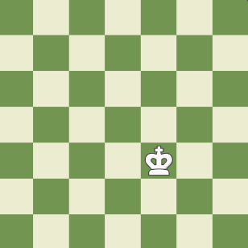

# 桌遊 (game)

本題為`互動題`，限用 C++ 上傳。
## 題目描述
----

tw87 在302後面發現了一款有趣的桌遊，這個桌遊由一張超級大的格子棋盤、一疊上面有某些數字的卡片、還有一隻國王所組成。

定義這個格子棋盤的左下角座標為 $(1, 1)$ ，一開始雙方會選定一些數字卡片 $S$ 代表可以移動的操作 (雙方的 $S$ 是一樣的)，這些數字卡片必須包含數字 $1$，接著將國王放在格子棋盤上的某個位置 $(x, y)$ 後雙方輪流移動國王，移動的那方只能將國王向左或向下移動 $k$ 步，這個 $k$ 必須為數字卡片中的其中一個數字，且不能將國王移動超出格子，當其中一方不能移動時就輸了，換句話說，就是把國王移到 $(1, 1)$ 的人獲勝。

由於 tw87 特別喜歡跟別人下棋，於是他找到了你，他特別讓你可以決定你要先手還是後手，你能找到一個策略讓你每一把都贏 tw87 嗎?




<div style="page-break-after: always"></div>

## 實作細節
----

你必須上傳一個檔案 game.cpp。
這個檔案必須在開頭加上 

```cpp
#include "game.h"
```

並實作以下函式

```cpp
int game_start(int x, int y, std::vector<int> S);
```
*  $(x, y)$ 代表一開始國王在座標 $(x, y)$ 上
* $S$ 代表抽取到的數字卡。
* 每筆測資恰會呼叫此函式一次
* 回傳 $1$ 代表你要先手，你要後手則回傳 $0$，回傳其他東西你會直接輸掉遊戲。
* 保證一開始會先呼叫此函式


接著正式評分程式會一直呼叫以下函式直到有一方將國王移動到 $(1, 1)$
```cpp
int play(int x, int y);
```
* 代表國王目前在座標 $(x, y)$ 上，且輪到你移動國王

* 你必須回傳一個整數 $k$
    * 如果 $k < 0$，代表你要將國王從 $(x, y)$ 移動到 $(x - |k|, y)$

    * 如果 $k > 0$，代表你要將國王從 $(x, y)$ 移動到 $(x, y - |k|)$

    * 你必須保證 $|k| \in S$ 且移動完後的國王座標 $(x', y')$， $x', y' \ge 1$，否則會判你犯規直接輸掉遊戲
* 呼叫完函式後，會先將國王依你要的操作移動到 $(x', y')$，若 $(x', y') = (1, 1)$ 則會結束程式。  
接著 tw87 會將國王從 $(x', y')$ 移動到 $(x'', y'')$，若 $(x'', y'') = (1, 1)$ 會結束程式，否則會再次呼叫 play($x''$, $y''$)
* 保證將國王從 $(x', y')$ 移動到 $(x'', y'')$ 是個合法的移動。

<div style="page-break-after: always"></div>

## 限制
----

* $S$ 必包含 $1$

* $1 \le x, y \le 10^5$

* $1 \le S_i < \max(x, y)$

* $1 \le |S| \le 100$

* $S$ 中元素兩兩相異

其中 $|S|$ 代表 $S$ 的大小

## 子任務
----

1. (20分) $x = 1$
2. (20分) $S = \\{1, 2, ..., \max(x - 1, y - 1)\\}, \max(x - 1, y - 1) \le 100$
2. (20分) $\max(x, y) \le 100$
3. (40分) 無限制


## 範例評分程式
----

範例評分程式第一行輸入三個整數 $n, x, y$，代表 $S$ 的大小為 $n$，一開始國王在座標 $(x, y)$。  
第二行輸入 $n$ 個整數，代表 $S$ 裡的元素。

接著會輸出你的程式移動後國王的座標，對於每次呼叫，你要輸入一個整數 $t$，代表 tw87 要移動的操作，$t < 0$ 代表 tw87 要將國王從 $(x, y)$ 移動到 $(x - |t|, y)$， $t > 0$ 代表 tw87 要將國王從 $(x, y)$ 移動到 $(x, y - |t|)$。

<div style="page-break-after: always"></div>

## 範例

## 範例 
----
### 範例 1
judge 呼叫
```
game_start(3, 3, {1})
```
回傳
```
0
```
* 你讓 tw87 先移動，他將國王從 (3, 3) 移動到 (3, 2)

judge 呼叫
```
play(3, 2)
```
回傳
```
1
```
* 代表你將國王從 (3, 2) 移動到 (3, 1)，接著 tw87 將國王從 (3, 1) 移動到 (2, 1)

judge 呼叫
```
play(2, 1)
```

回傳
```
-1
```

代表你將國王從 (2, 1) 移動到 (1, 1) 並且你獲勝了，因此程式結束